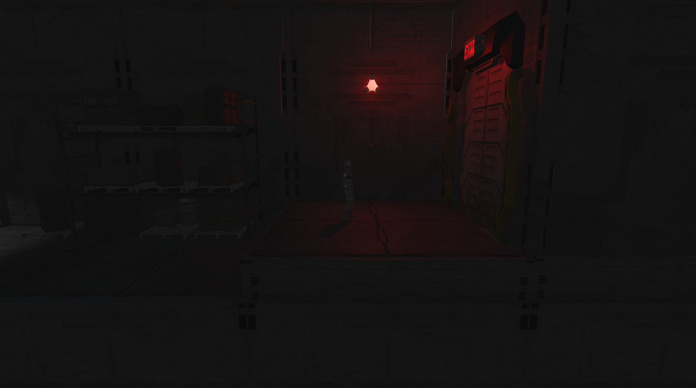
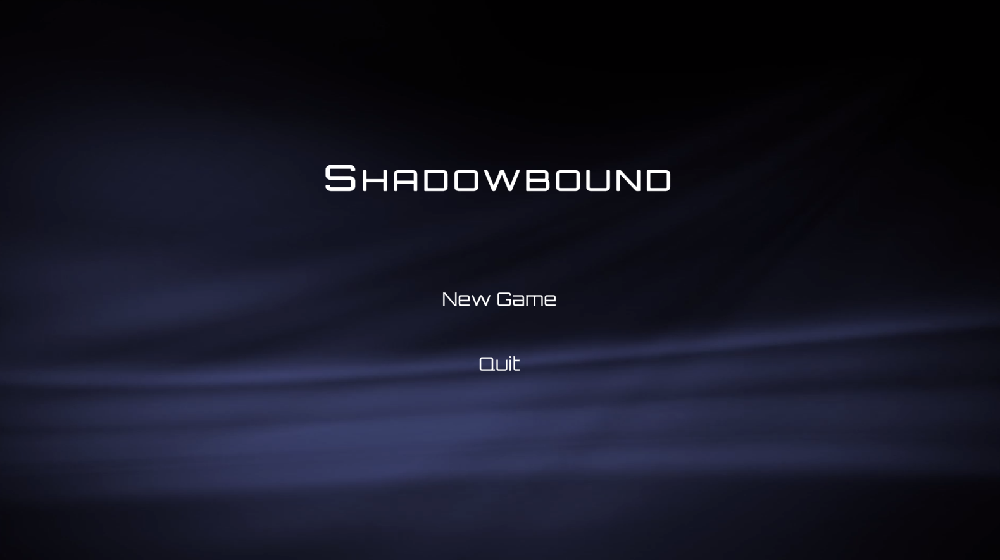

# Shadowbound

Project for the [**Design and Programming of Computer Games**](https://fipu.unipu.hr/fipu/en/course/dapocg) course (2023./2024.)

[**Full Gameplay**](https://youtu.be/Acd-PHO8JPA)  

[**Juraj Dobrila University of Pula**](https://www.unipu.hr/)  
[**Faculty of Informatics**](https://fipu.unipu.hr/)  

## Assets  

The assets for this project are not included in this repository due to size constraints. To set up the project:  

1. Download the assets [from this Google Drive link](https://drive.google.com/file/d/166tvQYItE7db0PKvlbMUSIBAzYP6yaiS/view?usp=sharing).  
2. Extract the downloaded zip file.  
3. Place the contents of the extracted folder directly into the `Assets` folder of your local repository.  

## Screenshots

